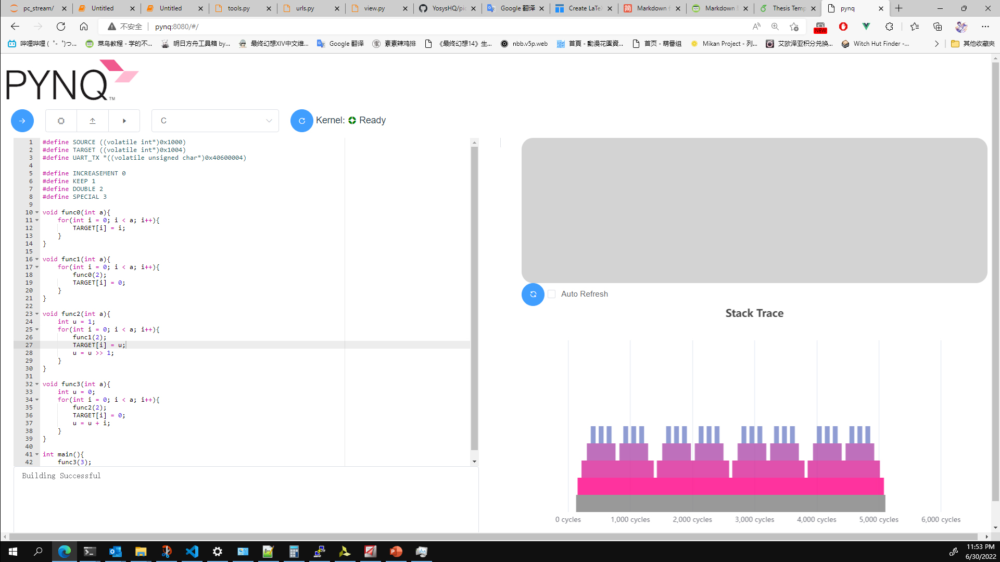
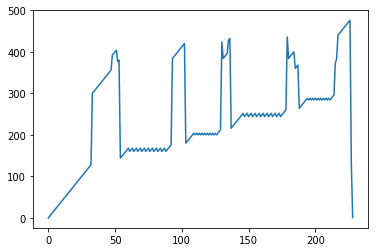
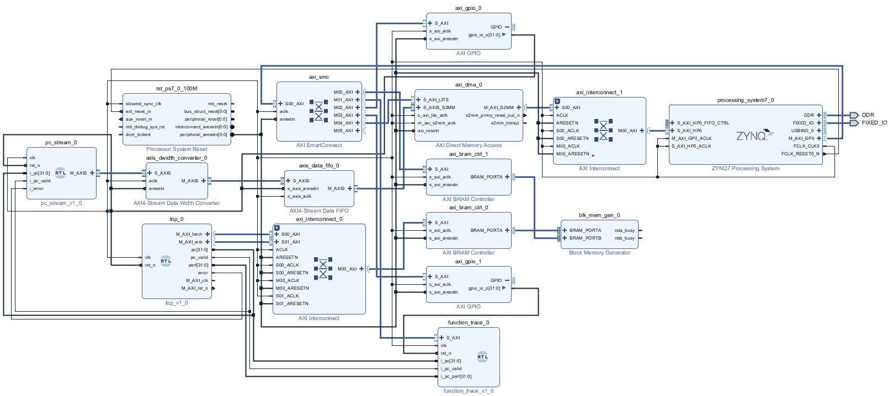

# Non-intrusive on Chip Monitoring System for RISC-V processor

Team Number: xohw22-095

This is a RISC-V kernel debugging project that provides a web page. All compilation, debugging, and tracing of the RISC-V core can be done on the web. Based on PYNQ, this project uses Django to build a web server and related processing functions, which can provide a highly scalable, high-performance, and easy-to-use online debugger.

This project is based on a self-made small RISC-V core, which provides basic rv32i instruction set support and AXI4 bus access, which can be used for basic 
function performance testing.



This system is also equipped with DMA that can directly export raw data. This module can directly export the raw data stream of the PC to PYNQ. And perform operations such as drawing in PYNQ. ``Example`` folder provide some example notebooks.




# STSTEM REQUIREMENTS

|||
|:-:|:--|
|System Version|2.7|
|Board|PYNQ-Z2|
|Vivado Version|2020.1|


# HOW TO USE

## 1. Install dependencies

Use the serial port to access PYNQ and switch to an account with root privileges

Use the following command

```shell
pip3 install django
```

Download the RISC-V toolchain [here](https://github.com/xpack-dev-tools/riscv-none-elf-gcc-xpack/releases/download/v12.1.0-2/xpack-riscv-none-elf-gcc-12.1.0-2-linux-arm.tar.gz), place the file in ``Django/tools``. Use folllowing command to unzip the GCC Compiler
```shell
tar -xvzf xpack-riscv-none-elf-gcc-12.1.0-2-linux-arm.tar.gz
```

## 2. Copy webserver System

Copy the django folder to anywhere in PYNQ

## 3. Start Server
```shell
cd Django/pynq
python3 manage.py runserver 0.0.0.0:8080
```


# File Structure
|Folder|Description|
|:--:|:--|
|Django|Django Web Server System. Include core code. This module uses the PYNQ library. This is a key component for combining web pages with pynq|
|RISCV|Small RISC-V core and related data processing modules. Include function tracing and PC-AXIS data conversion components|
|tools|Script for processing data|
|Vue|Related source code and tools for generating web pages.|

# How to change the website
The website is based on Vue.js and node.js. To change and recompile the website, Node.js is required. After Node.js is installed use following command to install the dependencies
```shell
cd Vue/pynq
npm install
``` 
Then change the App.vue. Use following command to recompile the Webpage
```shell
npm run build
```

# Import Block Design
1. Create a new project in Vivado 2020.1
2. Import the design source folder ``RISCV``
3. set the work folder to ``RISCV``, run following command to import the block design
```tcl
source onboard.tcl
```


# PC Data collection

For additional PC information, a jupyter notebook is provided to collect the PC stream from DMA. ``notebook`` folder provide the example juoyter notebook for reading the PC.